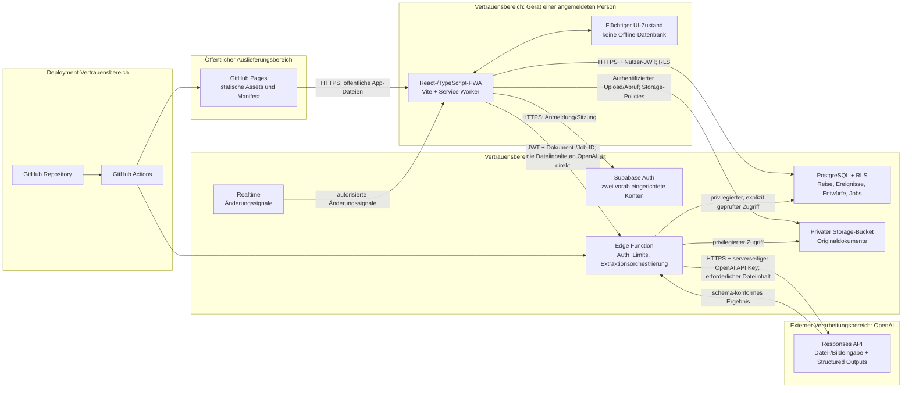

# Architekturentscheidung: Systemarchitektur des privaten Reiseplaners

**Status:** Für den MVP entschieden  
**Stand:** 2. August 2026  
**Grundlage:** Produktbrief und UX-Flows  
**Geltungsbereich:** Zwei vorab eingerichtete Konten, eine aktive gemeinsame Reise, höchstens 30 bestätigte Ereignisse und 50 Originaldokumente

## 1. Entscheidung

Der MVP wird als mobile-first React-/TypeScript-PWA mit Vite gebaut und als statisches Frontend über GitHub Pages ausgeliefert. Supabase übernimmt Authentifizierung, PostgreSQL, privaten Object Storage und Realtime. Eine authentifizierte Supabase Edge Function ist die einzige Komponente, die OpenAI aufrufen darf. Sie verwendet die OpenAI Responses API für Dokument- und Bildeingaben und fordert die Extraktion mittels Structured Outputs in einem versionierten, strikten JSON-Schema an.

Der OpenAI API Key liegt ausschließlich als serverseitiges Secret der Edge Function vor. Er wird weder in den Frontend-Build eingebettet noch an den Browser übertragen. Das Frontend kennt nur die öffentliche Supabase-Projekt-URL und den für Browser vorgesehenen Publishable-/Anon-Key; beide ersetzen keine Autorisierung. Der Zugriff auf Daten und Dateien wird durch Supabase Auth und Row Level Security (RLS) erzwungen.

Diese Architektur ist für den kleinen, privaten Nutzungsrahmen die günstigste realistische Variante: GitHub Pages verursacht für das statische Frontend voraussichtlich keine laufenden Hostingkosten, Supabase bündelt die benötigten Backend-Fähigkeiten, und nur die tatsächlich verwendete OpenAI-Extraktion ist verbrauchsabhängig. Gleichzeitig bleiben alle privaten Inhalte außerhalb des öffentlich ausgelieferten Frontends.

## 2. Verglichene Varianten

| Variante | Aufbau | Vorteile | Nachteile | Bewertung |
| --- | --- | --- | --- | --- |
| **A – GitHub Pages + Supabase + OpenAI** | React/Vite-PWA auf GitHub Pages; Supabase für Auth, PostgreSQL, Storage, Realtime und Edge Function; Responses API | Wenige Komponenten, geringe Betriebskosten, RLS und privater Storage aus einer Hand, Quellcode und Deployment passen zu GitHub | Statisches Hosting benötigt besondere SPA-Routing-Strategie; Limits und mögliche Pausierung kostenloser Dienste; Edge-Function-Laufzeit bei großen Dateien | **Gewählt** |
| B – Frontend und eigene Serverless Functions bei Vercel oder Cloudflare, Supabase für Daten | React-PWA und BFF bei einem zusätzlichen Plattformanbieter; Supabase weiterhin für Auth, DB und Storage | Flexible Request-Verarbeitung und Hosting-Routing; Backend nahe am Frontend | Zusätzlicher Anbieter und Vertrauensbereich, doppelte Betriebs- und Secret-Konfiguration, kein wesentlicher MVP-Nutzen gegenüber Supabase Edge Functions | Verworfen |
| C – Eigener Backend-Server mit selbst betriebenem PostgreSQL und Object Storage | React-PWA plus API, Datenbank und Dateispeicher auf VPS/NAS | Größte technische Kontrolle; Anbieterabhängigkeit reduzierbar | Betrieb, Updates, Backups, TLS, Monitoring und sichere Internetfreigabe liegen beim Zweierkreis; realistisch weder wartungsarm noch dauerhaft kostenlos | Verworfen |

Variante A ist keine allgemeine Empfehlung für ein öffentliches Mehrmandantenprodukt. Sie ist eine bewusste Optimierung für genau zwei bekannte Personen und den begrenzten MVP-Betriebsrahmen.

## 3. Systemdiagramm



## 4. Komponenten und Verantwortlichkeiten

### React-/TypeScript-/Vite-PWA

- stellt Anmeldung, Timeline, Ereignisformulare, Dokumentliste, Uploadstatus und Entwurfsprüfung bereit;
- validiert Eingaben früh für gute UX, ist aber nie die maßgebliche Sicherheits- oder Autorisierungsinstanz;
- spricht Supabase mit der angemeldeten Nutzersitzung an;
- lädt Originale ausschließlich in den privaten Supabase Storage hoch und niemals direkt zu OpenAI;
- ruft die Edge Function nur mit Dokument- oder Job-Identifikatoren auf;
- hält nicht gespeicherte Formulareingaben im laufenden UI-Zustand und kennzeichnet unsichere Speicherstände;
- zeigt ausschließlich bestätigte Ereignisse in der Timeline.

Vite erzeugt ausschließlich statische Assets. Für GitHub Pages wird der korrekte Basispfad konfiguriert. Für clientseitige Routen wird Hash-Routing bevorzugt, weil direkte Pfadaufrufe bei GitHub Pages sonst ohne Server-Fallback auf einer 404-Seite enden können.

### Supabase Auth

- verwaltet genau zwei persönliche Identitäten und Sitzungen;
- stellt signierte Zugriffstokens für Datenbank, Storage, Realtime und Edge Function aus;
- speichert keine Passwörter im Anwendungsschema;
- hat öffentliche Registrierung deaktiviert.

### PostgreSQL mit RLS

- ist die maßgebliche Quelle für Reise, bestätigte Ereignisse, Entwürfe, Dokumentmetadaten und Verarbeitungsstatus;
- erzwingt Mitgliedschaft des aktuellen Nutzers für jeden lesenden und schreibenden Zugriff;
- kapselt mehrschrittige fachliche Änderungen, insbesondere die Entwurfsbestätigung, in atomaren Transaktionen;
- hält Idempotenzschlüssel, Statusübergänge und eine einfache Versionsinformation für konkurrierende Änderungen vor.

Das Dokument legt bewusst kein vollständiges Datenbankschema fest. Benötigt werden konzeptionell eine Reise, unveränderlich administrierte Mitgliedschaften, Ereignisse, Dokumentmetadaten, Extraktionsjobs, Entwürfe und deren Verknüpfungen.

### Supabase Storage

- bewahrt jedes Original unverändert in einem privaten Bucket auf;
- ordnet Objekte über nicht erratbare technische IDs einer Reise und einem Dokumentdatensatz zu;
- erzwingt dieselbe Reisemitgliedschaft wie die Datenbank;
- stellt keine öffentlichen Bucket- oder dauerhaften Freigabe-URLs bereit.

### Supabase Realtime

- meldet Änderungen an Reise, Ereignissen, Dokumentstatus und Entwürfen an beide angemeldeten Clients;
- dient nur als Änderungssignal; der Client lädt anschließend den autorisierten, kanonischen Datensatz erneut;
- ist kein Ersatz für RLS, Transaktionen oder Konfliktprüfung.

### Supabase Edge Functions und Queue-Worker

- prüft das Nutzer-JWT und zusätzlich die Mitgliedschaft zur betroffenen Reise;
- nimmt niemals frei übermittelte Storage-Pfade oder OpenAI-Parameter ungeprüft an;
- setzt Dateigrößen-, Mengen-, Parallelitäts- und Nutzungslimits serverseitig durch;
- reserviert den Extraktionslauf in einer dauerhaften PostgreSQL-Queue und antwortet dem Browser mit `202`;
- ein ausschließlich intern aufrufbarer Worker beansprucht fällige Runs mit `FOR UPDATE SKIP LOCKED`, liest das Original, ruft OpenAI auf und validiert das Ergebnis erneut;
- schreibt nur Entwürfe und Status, niemals automatisch bestätigte Timeline-Ereignisse;
- besitzt den OpenAI API Key und einen Supabase-Service-Schlüssel. Der Worker-Aufruf verwendet ein getrenntes, zufälliges Credential; Function-Secret und Vault-Wert werden beim Backend-Deployment gemeinsam provisioniert.

Ein Service-Schlüssel umgeht RLS. Sein Einsatz ist deshalb auf die Edge Function beschränkt; vor jeder privilegierten Aktion erfolgt eine explizite Mitgliedschafts- und Zustandsprüfung.

### OpenAI Responses API

- erhält nur die zur konkreten Extraktion erforderliche Datei;
- verarbeitet PDF- und andere unterstützte Dokumenteingaben als Datei sowie unterstützte Bilder als Bildeingabe;
- liefert ein Structured-Outputs-Ergebnis nach einem serverseitig ausgewählten, versionierten JSON-Schema;
- ist nicht direkt vom Browser erreichbar.

Structured Outputs garantiert die Form, nicht die fachliche Richtigkeit. Deshalb bleiben serverseitige Validierung, Kennzeichnung unsicherer Felder und die verpflichtende menschliche Bestätigung bestehen.

## 5. Vertrauensgrenzen

1. **Browser ↔ GitHub Pages:** Sämtliche ausgelieferten Dateien sind öffentlich lesbar. In Builds dürfen daher keine privaten Daten, Service-Schlüssel oder der OpenAI API Key enthalten sein. Auch vermeintlich versteckte `VITE_*`-Variablen sind öffentlich.
2. **Browser ↔ Supabase:** Das Gerät besitzt eine Nutzersitzung, aber keine administrativen Rechte. Jede Anfrage muss durch Auth und RLS beziehungsweise Storage-Policies autorisiert werden. Clientseitige Filter sind keine Sicherheitsgrenze.
3. **Browser ↔ Edge Function:** Browserendpunkte akzeptieren nur ein gültiges Nutzer-JWT, prüfen die Reisemitgliedschaft und arbeiten idempotent. Der interne Queue-Worker ist nicht browserfähig, deaktiviert die Plattform-JWT-Prüfung und vergleicht stattdessen ein eigenes serverseitiges Worker-Credential, bevor er privilegierte Daten liest.
4. **Edge Function ↔ OpenAI:** Hier verlässt Dokumentinhalt den Supabase-Vertrauensbereich. Übertragen wird nur das angeforderte Original; Logs und Datenbank speichern keine vollständige Modellanfrage oder Dokumentkopie.
5. **GitHub Actions ↔ Laufzeitumgebungen:** Deployment-Zugangsdaten liegen als geschützte Actions-/Environment-Secrets vor und werden nicht in den Frontend-Build gereicht. Der OpenAI API Key soll direkt als Supabase-Secret verwaltet werden.

Ein kompromittiertes Gerät oder bösartiges Browser-Skript kann Inhalte der aktuell angemeldeten Person lesen. Deshalb sind eine strikte Content Security Policy, keine unnötigen Drittanbieter-Skripte, regelmäßige Abhängigkeitsupdates und das sichere Anzeigen fremder Dokumente erforderlich. Dokumentinhalt wird nicht als ungeprüftes HTML in die App eingebettet.

## 6. Authentifizierung und Einladungen

Für den MVP wird E-Mail und Passwort mit zwei außerhalb der App vorab eingerichteten, bestätigten Supabase-Auth-Konten verwendet. Öffentliche Registrierung, Rollenwahl, Self-Service-Einladung und Self-Service-Wiederherstellung bleiben deaktiviert beziehungsweise werden in der UI nicht angeboten. Falls ein Passwort administrativ zurückgesetzt werden muss, geschieht dies außerhalb der App.

Die zwei Auth-IDs werden einmalig als Mitglieder derselben Reise eingetragen. Die Anwendung darf diese Mitgliedschaften nicht anlegen, ändern oder löschen. Ein alter oder erfundener Einladungslink führt höchstens zur neutralen Anmeldung beziehungsweise zur Meldung, dass Einladungen nicht unterstützt werden, und verrät keine Reiseinformationen.

Die Wahl von E-Mail/Passwort vermeidet für den privaten MVP eine zusätzliche Abhängigkeit von zuverlässig zugestellten Magic Links. Ein späterer Wechsel des Anmeldeverfahrens verändert die Autorisierung über die stabilen Auth-IDs nicht.

## 7. Autorisierung der gemeinsamen Reise

RLS folgt einer einzigen Regel: Ein angemeldeter Nutzer darf einen Datensatz genau dann lesen oder ändern, wenn dessen Reise eine Mitgliedschaft mit seiner `auth.uid()` besitzt. Beide Mitglieder erhalten dieselben fachlichen Lese- und Schreibrechte. Es gibt im MVP keine Eigentümer-, Admin- oder Gastrolle.

Diese Regel gilt transitiv für Reise, Ereignisse, Entwürfe, Dokumentmetadaten und Extraktionsjobs. Storage-Policies prüfen denselben Zusammenhang anhand des dem Objekt zugeordneten Dokumentdatensatzes beziehungsweise eines serverseitig kontrollierten Pfadsegments. Realtime veröffentlicht nur Zeilen, die der Nutzer auch regulär lesen darf.

Besondere Schutzregeln:

- Mitgliedschaften können nur administrativ bereitgestellt werden.
- Es kann höchstens eine aktive Reise geben; diese Invariante wird in der Datenbank erzwungen, nicht nur in der UI.
- Entwurfsbestätigung erzeugt Ereignis und Dokumentverknüpfung atomar und idempotent.
- Lösch- und Änderungsanfragen prüfen eine Versionsnummer oder den zuletzt bekannten Änderungsstand, damit eine Person die zwischenzeitliche Änderung der anderen nicht still überschreibt.

## 8. Synchronisierung zwischen beiden Nutzern

Die Datenbank ist immer der kanonische Stand. Nach jeder Mutation schreibt der Client zuerst nach Supabase und zeigt Erfolg erst nach Serverbestätigung. Realtime verbessert die Wahrnehmung gemeinsamer Änderungen, ist aber nicht für Korrektheit erforderlich:

1. Beide Clients abonnieren nach Anmeldung nur die Datensätze der gemeinsamen Reise.
2. Ein Realtime-Ereignis invalidiert die betroffene Abfrage.
3. Der Client lädt den aktuellen Stand unter RLS neu und sortiert die Timeline stabil.
4. Nach Verbindungsabbruch oder Wiederaufnahme der PWA wird vollständig neu abgeglichen.

Gleichzeitige kollaborative Feldbearbeitung ist kein MVP-Ziel. Bei einem Versionskonflikt wird die zweite Speicherung abgelehnt und die Person erhält die Wahl, den neuen Stand zu laden und ihre Änderung erneut vorzunehmen. Realtime-Ausfälle führen damit höchstens zu verzögerter Anzeige, nicht zu abweichenden Datenständen.

## 9. Speicherung und Abruf von Originaldokumenten

Jedes Original wird unverändert in einem privaten Storage-Bucket gespeichert. In PostgreSQL liegen nur Metadaten wie technische ID, ursprünglicher Dateiname, gemeldeter und erkannter Medientyp, Größe, Prüfsumme, Status und Verknüpfungen. Dateinamen werden nicht als alleinige Objektadresse oder Berechtigungsmerkmal verwendet.

Der Abruf erfolgt als authentifizierter Storage-Download unter RLS. Für Vorschauen lädt die PWA den Blob mit ihrer Sitzung und erzeugt eine lokale, kurzlebige Object-URL, die beim Verlassen der Ansicht und beim Abmelden widerrufen wird. Es werden keine öffentlichen oder langlebigen signierten URLs erzeugt. Ein kopierter Storage-Pfad ist ohne gültige Sitzung wertlos. Bereits bewusst heruntergeladene Dateien können technisch nicht durch späteres Abmelden vom Gerät zurückgerufen werden.

Browserfähig darstellbare Formate dürfen als Vorschau gezeigt werden. Bei anderen Formaten bleibt der authentifizierte Download verfügbar. Eine erzeugte Vorschau ersetzt nie das Original.

Die Produktentscheidungen zur Aufbewahrung nach Verwerfen eines Entwurfs und zum Löschen eines Dokuments zusammen mit einem Ereignis bleiben offen. Technisch werden Ereignis und Original daher zunächst unabhängig mit expliziter Verknüpfung modelliert; keine Datenbank-Kaskade darf die noch offene Produktentscheidung vorwegnehmen.

## 10. Upload- und Extraktionsprozess

```mermaid
sequenceDiagram
    actor U as Angemeldete Person
    participant P as PWA
    participant S as Supabase DB/Storage
    participant F as Start-Function
    participant W as interner Queue-Worker
    participant O as OpenAI Responses API

    U->>P: Datei auswählen
    P->>S: Dokumentdatensatz idempotent anlegen
    P->>S: Original in privaten Bucket hochladen
    P->>S: Upload abschließen
    P->>F: Extraktion mit Dokument-ID starten
    F->>F: JWT, Mitgliedschaft, Status und Limits prüfen
    F->>S: Run und Budget atomar reservieren
    F-->>P: 202 Accepted
    F-->>W: Best-effort Worker-Kick
    W->>S: Fälligen Run mit SKIP LOCKED und Lease beanspruchen
    W->>O: Erforderliche Datei/Bild + striktes Ausgabeschema
    O-->>W: Schema-konformes Extraktionsergebnis und Usage
    W->>S: Providerkosten unverzüglich idempotent verbuchen
    W->>W: Semantik, Limits und Schema erneut validieren
    W->>S: Entwürfe und Endstatus atomar speichern
    S-->>P: Realtime-Signal; PWA lädt Status neu
    P-->>U: Entwürfe zur Kontrolle anzeigen
    U->>P: Korrigieren und ausdrücklich bestätigen
    P->>S: Ereignis idempotent und atomar erzeugen
    S-->>P: Bestätigtes Ereignis
```

### Prozessregeln

1. **Auswahl:** Der Browser prüft Größe und offensichtlichen Typ nur als UX-Hilfe. Die verbindliche Prüfung erfolgt serverseitig anhand Metadaten und, soweit praktikabel, Dateisignatur.
2. **Upload:** Jede Datei erhält eine zufällige Dokument-ID und einen Idempotenzschlüssel. Mehrfaches Tippen oder Wiederholen desselben laufenden Vorgangs legt nicht unkontrolliert Duplikate an.
3. **Status:** Dokument und Job durchlaufen persistente, monotone Zustände wie `uploading`, `uploaded`, `processing`, `drafts_ready`, `failed` oder `unsupported`. Die UI erfindet keinen Fortschrittsprozentsatz.
4. **Verarbeitung:** Der Worker beansprucht genau einen fälligen Job atomar. Eine Lease gilt 120 Sekunden; ein minütlicher Cron-Kick und jeder neue Start lösen Worker-Aufrufe aus. Abgelaufene Leases werden zurück in die Queue gestellt. Pro Dokument darf höchstens eine aktive Extraktion laufen; nach höchstens drei Provider-Versuchen endet ein Run terminal.
5. **OpenAI-Eingabe:** Unterstützte Dokumente einschließlich PDF werden als Dateieingabe, unterstützte Bilder als Bildeingabe über die Responses API verarbeitet. Die tatsächlich unterstützten Formate bleiben von gewähltem Modell und aktueller API abhängig; die App behauptet keine dauerhaft feste Positivliste.
6. **Structured Outputs:** Das strikte, versionierte Schema enthält eine Liste von Ereignisentwürfen der fünf zulässigen Arten, optionale Teilstrecken, zusätzliche Bezeichnung-Wert-Paare und Kennzeichnungen unsicherer Felder. Es begrenzt Anzahl und Länge frei erzeugbarer Werte.
7. **Servervalidierung:** Die Funktion akzeptiert trotz Structured Outputs nur bekannte Ereignisarten, plausible Datentypen und konfigurierte Größen. Fachlich unbekannte Angaben bleiben leer oder als unsicher markiert. Vollständige Modellantworten und Reasoning-Inhalte werden nicht dauerhaft gespeichert.
8. **Ergebnis:** Es entstehen nur editierbare Entwürfe. Erst die gesonderte, validierte Nutzerbestätigung erzeugt ein Timeline-Ereignis.
9. **OpenAI-Datei:** Falls die API einen temporären Datei-Upload verlangt, wird dessen ID nur für den Job gehalten und die Datei nach Abschluss bestmöglich gelöscht. Die tatsächlichen Aufbewahrungsbedingungen des gewählten OpenAI-Projekts müssen vor privater Nutzung geprüft und dokumentiert werden.

Die Verarbeitung läuft bereits als dauerhafte Datenbankqueue mit getrenntem Worker. Ein Start-Request wartet nicht auf Datei-Upload zu OpenAI oder Modellausgabe. Die Queue ist der kanonische Zustand; der direkte Worker-Kick ist nur eine Latenzoptimierung, während der Cron-Aufruf die Recovery-Garantie liefert. Laufzeit-, Speicher- und Requestlimits der Edge Function bleiben mit repräsentativen Dateien und absichtlichen Worker-Unterbrechungen zu testen.

## 11. API-Schlüssel und Secrets

- **OpenAI API Key:** ausschließlich Supabase-Secret der Edge Function; niemals GitHub-Pages-Variable, `VITE_*`-Variable, Repository-Secret eines Frontend-Buildschritts, Browser-Storage oder Logfeld.
- **Supabase Publishable-/Anon-Key und Projekt-URL:** dürfen im Browser stehen; Sicherheit entsteht durch RLS und Policies, nicht durch Geheimhaltung dieser Werte.
- **Supabase Service Role:** nur in der Edge-Function-Laufzeit, falls erforderlich; nie im Frontend oder statischen Build.
- **Deployment-Zugang:** Supabase-Zugriffstoken und Projektkennung liegen in einem geschützten GitHub Environment. Sie werden nur für Backend-Deployment verwendet und nicht an `vite build` weitergegeben.
- **Lokale Entwicklung:** Secrets liegen in nicht versionierten lokalen Umgebungsdateien beziehungsweise im lokalen Supabase-Secret-Store. Beispielwerte enthalten ausschließlich Platzhalter.
- **Rotation:** Schlüssel werden bei Verdacht sofort rotiert. Die Edge Function greift über Umgebungsvariablen darauf zu, sodass kein Codewechsel nötig ist.

CI prüft den erzeugten Frontend-Build auf bekannte Secret-Muster. Dieser Test ergänzt, aber ersetzt keine saubere Trennung der Build-Umgebungen.

## 12. Offline- und PWA-Strategie

Die PWA ist installierbar, aber online-first. Der Service Worker speichert ausschließlich versionierte statische App-Shell-Assets wie HTML, JavaScript, CSS, Icons und eine neutrale Offline-Seite vor. Authentifizierte Supabase-Antworten, Dokumente, Vorschaublobs, API-Aufrufe und Reisedaten werden ausdrücklich von Runtime-Caching ausgeschlossen.

- Bei vorhandener Verbindung werden Daten direkt von Supabase geladen.
- Bereits im offenen UI vorhandene Daten dürfen bei Verbindungsverlust sichtbar bleiben, werden aber als möglicherweise veraltet gekennzeichnet.
- Formulareingaben bleiben im Arbeitsspeicher der laufenden Ansicht erhalten; es gibt keine dauerhafte Offline-Warteschlange und keine zugesicherte Offline-Bearbeitung.
- Upload, Anmeldung, Speichern, Extraktion und geschützter Dokumentabruf benötigen eine Verbindung.
- Nach Wiederverbindung fragt die App den Serverstatus ab, bevor sie eine Mutation oder Extraktion wiederholt.
- Service-Worker-Updates werden kontrolliert aktiviert, damit eine neue Version kein geöffnetes Formular unerwartet verwirft.
- Safe Areas, Standalone-Modus, iOS-Dateiauswahl und eine Mindestbreite von 375 CSS-Pixeln sind Teil der Abnahme.

## 13. Deployment über GitHub Actions

Es gibt zwei getrennte Deployment-Pfade aus dem GitHub-Repository:

### Frontend

1. Pull Requests führen Typecheck, Linting, Tests, Produktionsbuild und PWA-/Manifest-Prüfungen aus.
2. Ein Merge in den geschützten Hauptbranch baut mit der öffentlichen Supabase-URL und dem Publishable-/Anon-Key.
3. Das unveränderliche Build-Artefakt wird über den offiziellen GitHub-Pages-Workflow veröffentlicht.
4. Der Workflow enthält keinen OpenAI- oder Supabase-Service-Schlüssel.

### Supabase

1. Versionierte Datenbankmigrationen, RLS-Policies und Edge Functions werden in einem getrennten Job gegen die Zielumgebung geprüft.
2. Das Deployment nutzt ein geschütztes GitHub Environment und die dafür nötigen Supabase-Zugangsdaten.
3. Migrationen werden vor dem davon abhängigen Frontend veröffentlicht; RLS-Tests mit beiden erlaubten und einer nicht erlaubten Identität sind ein Deployment-Gate.
4. Der OpenAI API Key wird nicht aus dem Repository deployed, sondern direkt im Supabase-Projekt als Secret gepflegt.

Frontend-Rollback erfolgt durch erneutes Veröffentlichen eines vorherigen Artefakts. Datenbankänderungen werden vorwärtskompatibel geplant; destruktive Migrationen sind für den MVP zu vermeiden. Ob GitHub Pages mit der gewünschten Repository-Sichtbarkeit im verwendeten GitHub-Tarif kostenlos verfügbar ist, muss vor Einrichtung bestätigt werden. Das Laufzeit-Frontend selbst ist unabhängig davon öffentlich abrufbar und darf daher keine privaten Inhalte enthalten.

## 14. Logging und Fehlerbehandlung

Jeder Upload und Extraktionsjob erhält eine zufällige Korrelations-ID. Edge-Function-Logs sind strukturiert und enthalten höchstens Korrelations-ID, technische Nutzer-ID, Dokument-ID, Status, Dauer, Größenklasse, Modell-/Schema-Version, OpenAI-Request-ID und einen normalisierten Fehlercode.

Nicht geloggt werden:

- Dokumentinhalt oder Modellprompt;
- vollständige Modellantworten;
- Passwörter, Zugriffstokens, API-Schlüssel oder Authorization-Header;
- Dateinamen, Buchungsnummern, Adressen oder andere fachliche Inhalte, sofern sie für die Diagnose nicht zwingend nötig sind.

Nutzer sehen stabile, verständliche Fehlerkategorien wie nicht unterstützt, zu groß, passwortgeschützt, Upload unterbrochen, Verarbeitung fehlgeschlagen, nicht zuordenbar oder vorübergehend nicht erreichbar. Interne Stacktraces und Providerantworten bleiben verborgen. Ein Fehler aktualisiert den Jobstatus atomar und verändert keine bestätigten Ereignisse.

Retries verwenden begrenztes exponentielles Backoff und nur idempotente Operationen. Nach unklarem Ausgang fragt der Client den Job- oder Mutationsstatus ab, statt blind erneut anzulegen. Dauerhaft fehlgeschlagene Jobs bleiben mit Original und handlungsorientiertem Status sichtbar. Für den privaten MVP genügen Supabase-/GitHub-Logs und persistierte Fehlercodes; ein zusätzlicher Tracking-Dienst würde einen weiteren Datenempfänger schaffen und ist zunächst nicht vorgesehen.

## 15. Kosten- und Nutzungsschutz

Die Architektur nutzt kostenlose Kontingente, setzt aber nicht voraus, dass Anbietergrenzen oder Preise dauerhaft unverändert bleiben. Vor jeder Reise werden aktuelle Kontingente und der Projektstatus geprüft.

Serverseitig durchzusetzende Schutzmaßnahmen:

- ausschließlich die zwei vorab eingerichteten Auth-IDs und eine aktive Reise;
- höchstens 50 Originaldokumente und 30 bestätigte Ereignisse;
- konfigurierbare, vor Nutzung festzulegende Obergrenze pro Datei und pro Upload-Stapel, stets unterhalb der jeweils kleineren Supabase-/OpenAI-Grenze;
- höchstens ein aktiver Extraktionsjob pro Dokument und eine kleine globale Parallelität;
- Tages- und Monatskontingent für Extraktionen sowie ein administrativer Sperrschalter;
- Idempotenzschlüssel und optional eine Prüfsumme, um versehentliche Wiederholungen zu erkennen;
- fest gewähltes, serverseitig konfiguriertes Modell, begrenzte Ausgabegröße und begrenzte Anzahl erzeugbarer Entwürfe/Teilstrecken;
- maximal wenige automatische Wiederholungen; fachliche Fehler lösen keinen kostenpflichtigen Retry-Loop aus;
- OpenAI-Projektbudget und Kostenwarnungen zusätzlich zu den Anwendungslimits.

Die PWA darf weder Modell, Tokenbudget noch OpenAI-Projekt frei wählen. Eine Überschreitung der Anwendungslimits erzeugt einen verständlichen Status und kann nur administrativ aufgehoben werden.

## 16. Datenschutz, Sicherung und Wiederherstellung

Die unvermeidbaren Datenempfänger sind Supabase für Speicherung/Betrieb und OpenAI für die angeforderte Extraktion. GitHub erhält ausschließlich Quellcode und statische Build-Artefakte, keine Reise- oder Dokumentdaten. Vor privater Nutzung sind Auftrags-/Datenschutzbedingungen, Datenregion, Modell- und API-Datenverwendung sowie Aufbewahrungsfristen der gewählten Anbieter zu prüfen. Eine Verbraucherschnittstelle darf nicht stillschweigend anstelle der API verwendet werden.

Vor dem Go-live wird ein dokumentierter administrativer Löschweg für Auth-Konten, Datenbankzeilen, Storage-Objekte und gegebenenfalls verbliebene OpenAI-Dateien festgelegt und getestet.

Da kostenlose Pläne keine ausreichende Wiederherstellungszusage garantieren müssen, braucht der MVP vor echter Nutzung außerdem ein getestetes, verschlüsseltes Backup-Verfahren außerhalb des Supabase-Projekts: mindestens ein logischer Export der strukturierten Daten und eine Kopie der Originaldokumente. Häufigkeit, Ziel, Schlüsselverwahrung und Wiederherstellungstest werden vor Nutzung festgelegt. Ein manuelles Verfahren ist für zwei Personen und höchstens 50 Dokumente akzeptabel, solange es dokumentiert und tatsächlich getestet ist.

## 17. Verworfene Alternativen

### Zusätzlicher Serverless-Anbieter

Vercel- oder Cloudflare-Functions könnten den OpenAI-Aufruf ebenfalls schützen. Sie würden aber einen weiteren Anbieter, eine weitere JWT-Verifikation, zusätzliche Deployments und einen weiteren Secret-Speicher einführen. Für zwei Personen liefert das keinen ausreichenden Gegenwert. Falls Edge-Function-Limits repräsentative Dokumente nicht verlässlich verarbeiten, ist diese Variante die erste Rückfalloption.

### Selbsthosting

Ein eigener Server vermeidet Teile der Plattformbindung, erhöht aber das reale Sicherheits- und Ausfallrisiko: Betriebssystem- und Datenbankupdates, private Objektspeicherung, TLS, Backups, Monitoring und Wiederherstellung müssten dauerhaft selbst betrieben werden. „Keine Anbieterrechnung“ wäre nicht mit „kostenlos und wartungsarm“ gleichzusetzen.

### OpenAI-Aufruf aus dem Browser

Diese Variante ist unabhängig von Kosten oder Bequemlichkeit ausgeschlossen. Jeder im Frontend verwendete API Key kann aus JavaScript, Netzwerkverkehr oder Browser-Speicher ausgelesen und missbraucht werden. Ein GitHub-Pages-Secret kann einen zur Laufzeit benötigten Browser-Schlüssel nicht geheim machen.

### Öffentlicher Storage oder langlebige signierte Links

Öffentlicher Storage verletzt den privaten Produktzweck. Langlebige signierte URLs bleiben nach Abmeldung bis zu ihrem Ablauf nutzbar und erfüllen den gewünschten Zugriffsschutz nicht. Deshalb erfolgen Upload und Abruf authentifiziert unter Storage-Policies.

### Vollständige Offline-Datenhaltung

IndexedDB-Synchronisation, Konfliktauflösung und Offline-Uploads würden den MVP deutlich vergrößern und stehen im Widerspruch zur ausdrücklichen Online-Annahme. Die PWA cached daher nur die App-Shell.

## 18. Offene technische Risiken und Prüfaufträge

1. **Edge-Function-Limits:** Laufzeit, Arbeitsspeicher und Requestgröße müssen mit realen PDF-, Bild-, DOCX- und EML-Dateien getestet werden. Bei Überschreitung ist ein asynchroner Worker beziehungsweise Variante B nötig.
2. **Dynamische Formatunterstützung:** Responses API und Modellunterstützung können sich ändern. Serverseitige Ablehnungsgründe und Konfiguration müssen aktualisierbar sein, ohne eine feste UI-Positivliste zu versprechen.
3. **Structured-Outputs-Komplexität:** Das umfangreiche Ereignismodell kann Schema- oder Ausgabelimits erreichen. Das Extraktionsschema muss mit allen fünf Arten, mehreren Ereignissen und Teilstrecken prototypisch validiert und gegebenenfalls in gemeinsame Hülle plus typisierte Details zerlegt werden.
4. **Semantische Fehler:** Schema-Konformität verhindert keine erfundenen oder falsch zugeordneten Daten. Unsicherheitsmarkierung, Originalvergleich und menschliche Bestätigung bleiben zwingend.
5. **OpenAI-Dateiverarbeitung:** Unterstützte Formate, Größen, Aufbewahrung, Löschung und Datenverwendung müssen vor Implementierung anhand der dann aktuellen offiziellen API-Dokumentation und Projekteinstellungen bestätigt werden.
6. **iOS-PWA-Verhalten:** Große Uploads können beim App-Wechsel oder Sperren abbrechen; Resume-Fähigkeit und Dateiquellen sind auf dem Ziel-iPhone zu testen. HEIC/HEIF wird nicht versprochen.
7. **RLS-Fehlkonfiguration:** Ein Policy-Fehler wäre der größte Vertraulichkeitsfehler. Automatisierte Negativtests für fremde/abgemeldete Identitäten sowie Storage und Realtime sind zwingend.
8. **Konkurrierende Bearbeitung:** Optimistische Versionsprüfung muss verhindern, dass die zweite Person unbemerkt Änderungen überschreibt. Eine automatische Zusammenführung ist nicht vorgesehen.
9. **Kostenloser Betrieb:** Freikontingente, Projektpausierung, Build-Minuten, Storage und Pages-Verfügbarkeit hängen von aktuellen Anbieterbedingungen ab und sind vor Nutzung zu verifizieren.
10. **Backup und Löschung:** Ein kostenloses Managed-Backend ersetzt kein getestetes Export-, Restore- und Gesamtlöschverfahren.
11. **Zeitzonen:** Speicherung und Validierung lokaler Zeiten mit fachlicher Zeitzone, Datumswerten ohne Uhrzeit und mehrzonigen Teilstrecken benötigt einen eigenen technischen Spike.
12. **Offene Produktregeln:** Dateigrenzen, Aufbewahrung verworfener Originale, Löschkaskaden, weitere Extraktionssprachen und Gruppierung von Teilstrecken müssen vor der jeweiligen Implementierung entschieden werden.

## 19. Konsequenzen der Entscheidung

Die gewählte Lösung hält Betrieb und Kosten klein, ohne den OpenAI API Key oder private Dokumente dem statischen Frontend anzuvertrauen. Sie akzeptiert dafür Plattformabhängigkeit von Supabase und OpenAI sowie begrenzte Hintergrundverarbeitung in Edge Functions. Sicherheit hängt wesentlich von korrekt getesteten RLS-/Storage-Policies ab. Realtime verbessert die gemeinsame Nutzung, während Datenbanktransaktionen, Idempotenz und erneutes Laden die eigentliche Konsistenz sichern.

Die Architektur lässt die fachlich offenen Lösch-, Aufbewahrungs-, Grenzwert- und Gruppierungsentscheidungen bewusst offen. Sie definiert nur die technischen Trennlinien, die unabhängig davon gelten: Originale bleiben privat, Extraktionen bleiben Entwürfe, Nutzer bestätigen ausdrücklich, und kein OpenAI-Schlüssel erreicht jemals den Browser.
