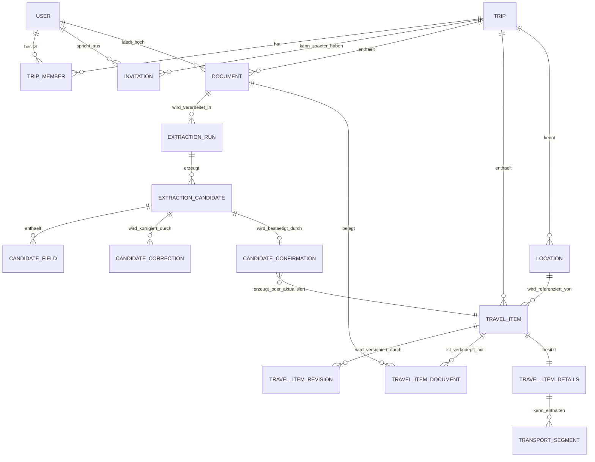
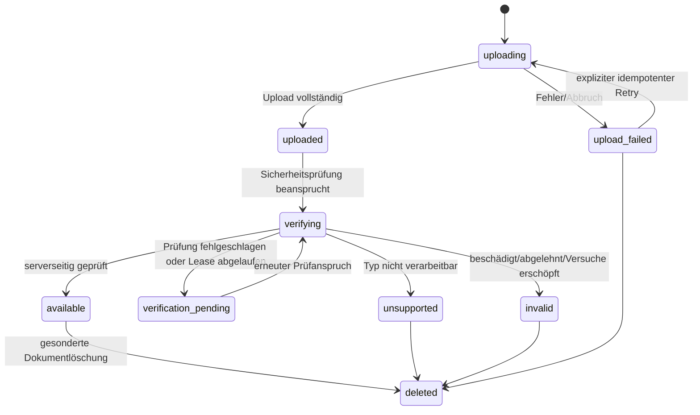
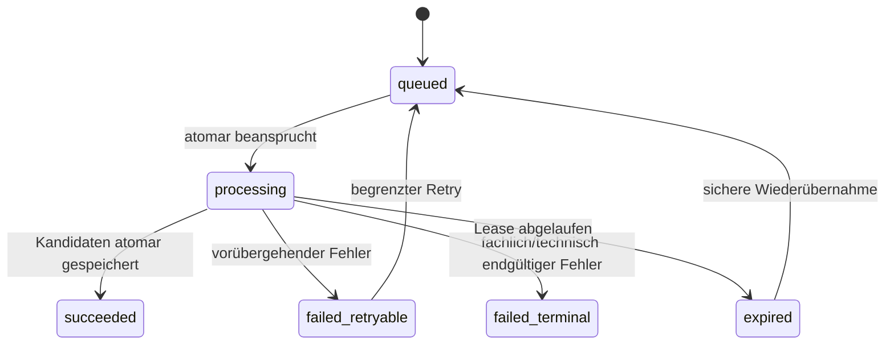
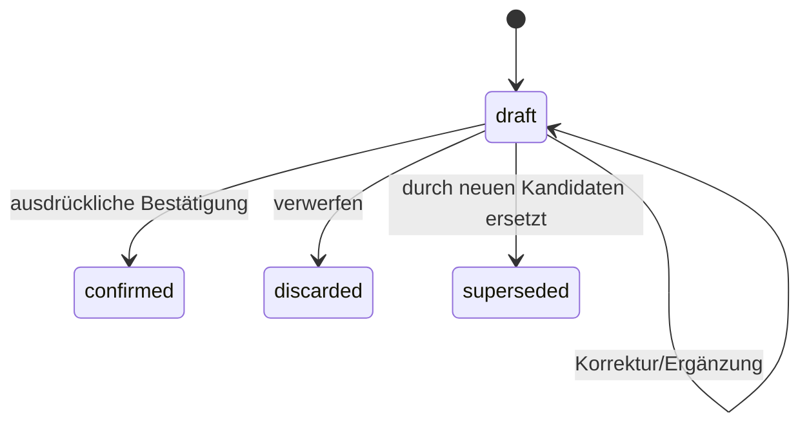
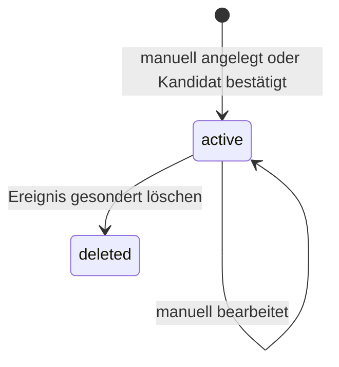

# Fachliches Datenmodell des Reiseplaners

**Status:** Fachlicher Entwurf für den MVP  
**Stand:** 2. August 2026  
**Grundlagen:** `docs/product/brief.md` und `docs/architecture/system.md`  
**Nicht Bestandteil:** SQL-Migrationen, physische PostgreSQL-Definitionen und LLM-JSON-Schema

## 1. Zweck und Modellierungsgrundsätze

Dieses Modell beschreibt den kanonischen fachlichen Datenbestand des privaten Reiseplaners. Es trennt konsequent vier Ebenen:

1. Ein **Document** ist ein unverändertes hochgeladenes Original mit Metadaten.
2. Ein **ExtractionRun** ist ein einzelner, nachvollziehbarer Verarbeitungsversuch für ein Dokument.
3. Ein **ExtractionCandidate** ist ein unbestätigter, korrigierbarer Vorschlag und niemals Bestandteil der Timeline.
4. Ein **TravelItem** ist ein ausdrücklich bestätigtes oder manuell angelegtes Reiseereignis.

Aus einem Dokument können null, ein oder mehrere Kandidaten und daraus null, ein oder mehrere TravelItems entstehen. Ein TravelItem kann umgekehrt mit mehreren Dokumenten belegt sein. Dokument und TravelItem haben unabhängige Lebenszyklen; keine Löschung wird zwischen ihnen kaskadiert.

Für den MVP existieren genau die fünf fachlichen Ereignisarten:

- `accommodation` – Unterkunft
- `flight` – Flug
- `rail` – Bahn
- `bus` – Bus
- `activity` – Aktivität

Es gibt keine generische Ereignisart. Erweiterbarkeit entsteht durch eine stabile gemeinsame Basis, additive typspezifische Detailmodelle, versionierte Zusatzattribute und einen erweiterbaren Ereignistyp-Katalog.

## 2. Notation und übergreifende Konventionen

- **PK** bezeichnet einen Primärschlüssel, **FK** einen Fremdschlüssel und **UK** eine fachlich eindeutige Schlüsselkombination.
- Fachliche Datensätze erhalten undurchsichtige UUIDs. Ob dafür UUIDv7 oder die von der Plattform unmittelbar unterstützte UUID-Variante verwendet wird, wird erst im physischen Datenmodell entschieden.
- Alle FKs verwenden denselben ID-Typ wie der referenzierte PK.
- `created_at`, `updated_at`, Bestätigungs-, Korrektur- und Löschzeitpunkte sind technische Zeitpunkte und werden als UTC-Instant gespeichert.
- Von Nutzern änderbare Aggregate besitzen `version` als positive, bei jeder Änderung um eins erhöhte Ganzzahl für optimistische Konfliktprüfung.
- `created_by_user_id`, `updated_by_user_id`, `deleted_by_user_id` und ähnliche Akteursfelder verweisen auf `User.id`, sofern die Aktion von einem Nutzer stammt. Rein systemische Aktionen besitzen stattdessen einen expliziten Systemakteur beziehungsweise keinen Nutzer-FK.
- Pflichtangaben sind mit **P**, optionale Angaben mit **O**, bedingt verpflichtende Angaben mit **B** gekennzeichnet.
- Fachliche Codes wie Status, Präzision oder Ereignisart sind kontrollierte Werte, keine frei eingegebenen Texte.

## 3. Fachliche Übersicht

`CandidateField`, `CandidateCorrection`, `CandidateConfirmation`, `TravelItemRevision`, `TravelItemDocument`, `TravelItemDetails` und `TransportSegment` sind unterstützende Entitäten. Sie machen Herkunft, Korrekturen, n:m-Beziehungen, Versionen und typspezifische Daten explizit.

## 4. Kernentitäten

### 4.1 User

Ein persönliches, vorab administrativ eingerichtetes Konto. Authentifizierungsgeheimnisse gehören nicht in das fachliche Modell.

| Feld | Art | Beschreibung |
| --- | --- | --- |
| `id` | PK, P | Identisch zur stabilen Supabase-Auth-ID; fachlicher FK auf die externe Auth-Identität. |
| `display_name` | P | In der gemeinsamen Reise angezeigter Name. |
| `account_status` | P | `active` oder `disabled`; im normalen MVP-Betrieb `active`. |
| `created_at` | P | Technischer Anlagezeitpunkt in UTC. |
| `updated_at` | P | Letzter technischer Änderungszeitpunkt in UTC. |
| `version` | P | Optimistische Version. |

Beziehungen:

- Ein User besitzt über `TripMember` Mitgliedschaften in Reisen.
- Ein User kann Dokumente hochladen, Kandidaten korrigieren oder bestätigen und TravelItems bearbeiten.
- Im MVP existieren genau zwei aktive User.

### 4.2 Trip

Gemeinsamer Container für Mitglieder, Dokumente, Kandidaten, Orte und bestätigte Ereignisse.

| Feld | Art | Beschreibung |
| --- | --- | --- |
| `id` | PK, P | Technische Reise-ID. |
| `title` | P | Frei änderbarer Reisetitel. |
| `start_date` | P | Lokales kalendarisches Startdatum der Reise. |
| `end_date` | P | Lokales kalendarisches Enddatum der Reise. |
| `lifecycle_status` | P | Im MVP `active`; `closed` ist nur als spätere administrative Ausprägung reserviert. |
| `created_at`, `updated_at` | P | Technische UTC-Zeitpunkte. |
| `created_by_user_id` | FK → User, P | Anlegender administrativer Nutzer beziehungsweise initiales Mitglied. |
| `updated_by_user_id` | FK → User, P | Letzter ändernder Nutzer. |
| `version` | P | Optimistische Version. |

Invarianten:

- `end_date >= start_date`.
- Es existiert höchstens eine Reise mit `lifecycle_status = active`.
- Die aktive MVP-Reise besitzt genau zwei aktive Mitglieder.

### 4.3 TripMember

Ordnet einen User einer Reise zu. Die Entität ist trotz des festen Zweierkreises erforderlich, weil sämtliche Autorisierung über die Mitgliedschaft erfolgt.

| Feld | Art | Beschreibung |
| --- | --- | --- |
| `trip_id` | PK, FK → Trip, P | Reise. |
| `user_id` | PK, FK → User, P | Mitglied. |
| `membership_status` | P | `active` oder `disabled`; im MVP administrativ verwaltet. |
| `joined_at` | P | Technischer UTC-Zeitpunkt der administrativen Zuordnung. |
| `created_by_user_id` | FK → User, O | Administrativer Akteur, falls als Anwendungsidentität vorhanden. |

Es gibt im MVP kein Rollenfeld: Beide Mitglieder sind fachlich gleichberechtigt. Anlage, Änderung und Löschung einer Mitgliedschaft sind nicht über die PWA erlaubt.

### 4.4 Invitation

Vorbereitete Zukunftsentität für eine mögliche spätere Einladung. Einladungen sind ausdrücklich **nicht Teil des MVP**; daher werden im MVP keine Invitation-Datensätze erzeugt und keine zugehörigen PWA-Rechte angeboten.

| Feld | Art | Beschreibung |
| --- | --- | --- |
| `id` | PK, P | Technische Einladungs-ID. |
| `trip_id` | FK → Trip, P | Zielreise. |
| `invited_email_normalized` | P | Normalisierte Zieladresse; nur für eine spätere Einladungsfunktion. |
| `invited_by_user_id` | FK → User, P | Einladender Nutzer. |
| `token_digest` | UK, P | Ausschließlich ein nicht rückrechenbarer Token-Digest, niemals der Klartext-Token. |
| `status` | P | `pending`, `accepted`, `expired`, `revoked`. |
| `expires_at` | P | Ablaufzeitpunkt in UTC. |
| `accepted_by_user_id` | FK → User, O | Bei Annahme zugeordnetes Konto. |
| `accepted_at`, `revoked_at` | O | Technische UTC-Zeitpunkte. |
| `created_at`, `updated_at` | P | Technische UTC-Zeitpunkte. |
| `version` | P | Optimistische Version. |

Eine spätere Annahme müsste Invitation und TripMember atomar verbinden. Diese Funktion ist im MVP deaktiviert.

### 4.5 Document

Metadaten eines unverändert im privaten Object Storage gespeicherten Originals. Das Document ist weder Kandidat noch TravelItem.

| Feld | Art | Beschreibung |
| --- | --- | --- |
| `id` | PK, P | Zufällige, nicht erratbare Dokument-ID. |
| `trip_id` | FK → Trip, P | Zugehörige Reise. |
| `uploaded_by_user_id` | FK → User, P | Hochladendes Mitglied. |
| `upload_idempotency_key` | P | Vom Client erzeugter Schlüssel gegen unbeabsichtigte Mehrfachanlage. |
| `original_file_name` | P | Ursprünglicher Dateiname zur Anzeige; kein Storage-Schlüssel. |
| `reported_media_type` | O | Vom Client gemeldeter Medientyp. |
| `detected_media_type` | O | Serverseitig erkannter Medientyp. |
| `byte_size` | P | Größe des Originals in Bytes. |
| `checksum` | O | Prüfsumme des unveränderten Originals zur Integritäts- und Duplikatprüfung. |
| `storage_object_key` | UK, B | Serverseitig kontrollierter privater Objektpfad; ab erfolgreichem Upload erforderlich. |
| `status` | P | Dokument-Lebenszyklus, siehe Zustandsmodell. |
| `error_code` | O | Stabiler, nicht sensitiver Fehlercode. |
| `error_detail_safe` | O | Nutzergeeignete, inhaltsfreie Fehlerergänzung. |
| `created_at`, `updated_at` | P | Technische UTC-Zeitpunkte. |
| `uploaded_at` | O | Zeitpunkt des vollständig abgeschlossenen Uploads. |
| `deleted_at` | O | Zeitpunkt der fachlichen Löschung. |
| `deleted_by_user_id` | FK → User, O | Löschender Nutzer. |
| `version` | P | Optimistische Version. |

Die Metadaten enthalten keine Dokumentinhalte, vollständigen Modellantworten oder öffentlichen Download-URLs. Bei Löschung kann ein minimaler Tombstone mit ID und notwendigen Herkunftsreferenzen erhalten bleiben; Umfang und Aufbewahrungsdauer sind offen.

### 4.6 ExtractionRun

Ein persistenter Verarbeitungsversuch für genau ein Document. Ein Retry legt einen neuen Run mit eigener Versuchshistorie an oder beansprucht ausschließlich einen ausdrücklich retry-fähigen Run nach einer noch festzulegenden technischen Regel; niemals werden bestätigte TravelItems still verändert.

| Feld | Art | Beschreibung |
| --- | --- | --- |
| `id` | PK, P | Technische Run-ID. |
| `document_id` | FK → Document, P | Zu verarbeitendes Original. |
| `requested_by_user_id` | FK → User, P | Auslösender Nutzer. |
| `idempotency_key` | P | Verhindert doppelte Runs derselben Nutzeraktion. |
| `attempt_number` | P | Fortlaufende Versuchszahl je Dokument. |
| `status` | P | Run-Lebenszyklus, siehe Zustandsmodell. |
| `correlation_id` | UK, P | Inhaltsfreie ID für Diagnose und Logs. |
| `model_identifier` | P | Serverseitig gewähltes Modell. |
| `extraction_schema_version` | P | Version des verwendeten Extraktionsvertrags, ohne dessen JSON-Struktur hier festzulegen. |
| `prompt_version` | P | Version der serverseitigen Extraktionsanweisung. |
| `provider_request_id` | O | Diagnose-ID des Providers, sofern verfügbar. |
| `lease_owner`, `lease_expires_at` | O | Technische Job-Beanspruchung für sichere Verarbeitung/Übernahme. |
| `started_at`, `completed_at` | O | Technische UTC-Zeitpunkte. |
| `error_code`, `error_detail_safe` | O | Stabile, nicht sensitive Fehlerangaben. |
| `created_at`, `updated_at` | P | Technische UTC-Zeitpunkte. |

Vollständige Prompts, Reasoning-Inhalte und vollständige rohe Modellantworten werden nicht dauerhaft gespeichert.

### 4.7 ExtractionCandidate

Ein aus einem ExtractionRun hervorgegangener, editierbarer Ereignisvorschlag. Er besitzt keine Timeline-Wirkung.

| Feld | Art | Beschreibung |
| --- | --- | --- |
| `id` | PK, P | Technische Kandidaten-ID. |
| `extraction_run_id` | FK → ExtractionRun, P | Erzeugender Run. |
| `candidate_index` | P | Stabile Reihenfolge innerhalb des Runs. |
| `proposed_event_type_code` | FK → EventTypeDefinition, P | Vorgeschlagene und korrigierbare Ereignisart. |
| `status` | P | `draft`, `confirmed`, `discarded` oder `superseded`. |
| `overall_confidence` | O | Normalisierte Unsicherheitsangabe, sofern fachlich belastbar vorhanden. |
| `candidate_format_version` | P | Version der internen Kandidatenrepräsentation. |
| `created_at`, `updated_at` | P | Technische UTC-Zeitpunkte. |
| `discarded_at` | O | Zeitpunkt des Verwerfens. |
| `discarded_by_user_id` | FK → User, O | Verwerfender Nutzer. |
| `version` | P | Optimistische Version der bearbeitbaren Kandidatenansicht. |

Ein Candidate enthält seine Werte und Herkunft über `CandidateField`; Nutzerkorrekturen werden über `CandidateCorrection` nachvollziehbar. Der wirksame Prüfstand ergibt sich aus Originalfeldern plus Korrekturen. Beim Verwerfen bleiben Candidate, Originalfelder, Korrekturen und Originaldokument erhalten; `discarded` ist terminal und erzeugt kein TravelItem.

### 4.8 TravelItem

Ein bestätigtes oder manuell angelegtes Reiseereignis. Nur aktive TravelItems erscheinen in der Timeline.

#### Gemeinsame Basis

| Feld | Art | Beschreibung |
| --- | --- | --- |
| `id` | PK, P | Technische Ereignis-ID. |
| `trip_id` | FK → Trip, P | Zugehörige Reise. |
| `event_type_code` | FK → EventTypeDefinition, P | Eine der fünf MVP-Arten. |
| `title` | P | Frei änderbarer Titel. |
| `booking_status` | P | `confirmed`, `cancelled` oder `unknown`. |
| `lifecycle_status` | P | `active` oder `deleted`; unabhängig vom Buchungsstatus. |
| `creation_source` | P | `manual` oder `candidate_confirmation`. |
| `created_from_candidate_id` | FK → ExtractionCandidate, O | Nur bei erstmaliger Anlage aus einem Kandidaten. |
| `start_time` | P | Fachlicher Zeitwert; mindestens lokales Startdatum. |
| `end_time` | O | Fachlicher Zeitwert. |
| `main_location_id` | FK → Location, O | Hauptort. |
| `start_location_id` | FK → Location, O | Startort. |
| `end_location_id` | FK → Location, O | Ziel-/Endort. |
| `provider_name` | O | Anbieter/Betreiber/Veranstalter. |
| `booking_platform_name` | O | Vermittler oder Buchungsplattform. |
| `management_url` | O | Buchungs-, Check-in- oder Verwaltungslink. |
| `booking_date` | O | Kalendarisches Buchungsdatum. |
| `notes` | O | Freie Notizen. |
| `stable_sort_key` | P | Unveränderlicher Tie-Breaker für identische Timeline-Zeitpunkte, in der Regel die ID. |
| `created_at`, `updated_at` | P | Technische UTC-Zeitpunkte. |
| `created_by_user_id`, `updated_by_user_id` | FK → User, P | Anlegender und zuletzt ändernder Nutzer. |
| `deleted_at`, `deleted_by_user_id` | O | Fachliche Löschung und Akteur. |
| `version` | P | Optimistische Version. |

Der gemeinsame Bereich kann zusätzlich folgende wiederholbare Wertgruppen besitzen:

- Referenzen: Typ (`booking`, `reservation`, `order`, `ticket`, `voucher`, `other`) und Wert.
- Reisende/Gäste: Anzeigename und optionale Rolle, ohne unnötige Identitätsdaten.
- Anbieter-Kontakte: Telefon, E-Mail, Website und Kontaktrolle.
- Preisangaben: Gesamtpreis, bezahlt, offen, Steuern/Gebühren, ISO-4217-Währung, Zahlungsstatus und maskierte Zahlungsart ohne vollständige Zahlungsdaten.
- Stornierungsdaten: Frist als fachlicher Zeitwert, strukturierte Bedingung und/oder Freitext.
- Zusatzattribute: Bezeichnung, typisierter Wert, optionale Einheit, Reihenfolge und Herkunft.

Diese wiederholbaren Gruppen werden physisch als abhängige Datensätze oder gleichwertig stark validierte Strukturen abgebildet. Ihre endgültige physische Form ist keine Entscheidung dieses Dokuments.

### 4.9 Location

Reisebezogener, wiederverwendbarer Ort. Location ist kein globaler Adressstammdatensatz und erfordert keine automatische Deduplizierung.

| Feld | Art | Beschreibung |
| --- | --- | --- |
| `id` | PK, P | Technische Orts-ID. |
| `trip_id` | FK → Trip, P | Reise, in deren Kontext der Ort verwendet wird. |
| `name` | P | Anzeigename, zum Beispiel Flughafen oder Unterkunft. |
| `full_address` | O | Unveränderte beziehungsweise formatierte Gesamtadresse. |
| `street`, `house_number`, `postal_code`, `city`, `region`, `country_code` | O | Strukturierte Adressbestandteile; `country_code` nach ISO 3166-1 alpha-2, wenn bekannt. |
| `location_code_type` | O | Zum Beispiel `iata`, `icao`, `station`, `stop`, `provider`. |
| `location_code` | O | Orts-/Anbietercode. |
| `latitude`, `longitude` | O | Koordinaten; nur gemeinsam oder beide leer. |
| `iana_time_zone` | O | Typische fachliche Zeitzone des Orts als IANA-Zonenname. Sie ersetzt nicht die am konkreten Zeitwert gespeicherte Zone. |
| `created_at`, `updated_at` | P | Technische UTC-Zeitpunkte. |
| `created_by_user_id`, `updated_by_user_id` | FK → User, P | Akteure. |
| `version` | P | Optimistische Version. |

Ein Location-Datensatz darf nur von Entitäten derselben Reise referenziert werden.

## 5. Unterstützende Herkunfts- und Versionierungsentitäten

### 5.1 CandidateField

Unveränderter, vom Extraktionslauf gelieferter Originalwert eines fachlichen Felds.

| Feld | Art | Beschreibung |
| --- | --- | --- |
| `id` | PK, P | Technische Feldwert-ID. |
| `candidate_id` | FK → ExtractionCandidate, P | Kandidat. |
| `field_path` | P | Stabiler semantischer Pfad im fachlichen Kandidatenmodell, einschließlich Segment-/Listenkontext. |
| `occurrence_key` | O | Stabile Identität eines wiederholbaren Werts. |
| `original_value` | P | Typisierter Originalwert des Modellergebnisses; explizites `null` wird von „Feld nicht geliefert“ unterschieden. |
| `confidence` | O | Feldbezogene Unsicherheitsangabe. |
| `source_document_id` | FK → Document, P | Herkunftsdokument. |
| `source_locator` | O | Nicht sensitiver Fundstellenhinweis, zum Beispiel Seite, Abschnitt oder Koordinatenbereich. Kein vollständiger Dokumentinhalt. |
| `created_at` | P | Technischer UTC-Zeitpunkt. |

`original_value` wird nie überschrieben. Ein vom Modell nicht gelieferter Wert kann durch eine Nutzerkorrektur ergänzt werden.

### 5.2 CandidateCorrection

Append-only-Korrektur eines Kandidatenfelds.

| Feld | Art | Beschreibung |
| --- | --- | --- |
| `id` | PK, P | Technische Korrektur-ID. |
| `candidate_id` | FK → ExtractionCandidate, P | Kandidat. |
| `field_path`, `occurrence_key` | P/O | Betroffener fachlicher Wert. |
| `operation` | P | `set`, `remove`, `add_occurrence`, `remove_occurrence` oder `reorder`. |
| `previous_effective_value` | O | Vor der Korrektur wirksamer Wert zur Konflikt- und Herkunftsprüfung. |
| `new_value` | P | Neuer Wert; bei Entfernen wird die Entfernen-Operation mit einem expliziten JSON-`null` protokolliert. |
| `reason` | O | Optionale kurze Nutzerbegründung. |
| `corrected_by_user_id` | FK → User, P | Korrigierendes Mitglied. |
| `corrected_at` | P | Technischer UTC-Zeitpunkt. |
| `candidate_version_after` | P | Kandidatenversion nach Anwendung. |

Damit bleiben Originalwert, jede Korrektur, effektiver Wert, Akteur, Zeitpunkt und Dokumentherkunft nachvollziehbar. Eine UI muss daraus keinen allgemeinen Änderungsverlauf anbieten.

### 5.3 CandidateConfirmation

Protokolliert die eine ausdrückliche Bestätigung eines Kandidaten und macht sie idempotent.

| Feld | Art | Beschreibung |
| --- | --- | --- |
| `id` | PK, P | Technische Bestätigungs-ID. |
| `candidate_id` | FK → ExtractionCandidate, UK, P | Genau einmal bestätigbarer Kandidat. |
| `travel_item_id` | FK → TravelItem, P | Erzeugtes Ereignis. |
| `confirmation_mode` | P | Im MVP ausschließlich `create`. |
| `candidate_version` | P | Bestätigte Candidate-Version. |
| `idempotency_key` | UK, P | Schutz gegen wiederholte Bestätigungsanfragen. |
| `confirmed_by_user_id` | FK → User, P | Bestätigendes Mitglied. |
| `confirmed_at` | P | Technischer UTC-Zeitpunkt. |

Bestätigung, TravelItem-Mutation, neue TravelItemRevision und Dokumentverknüpfung erfolgen in einer atomaren Operation.

### 5.4 TravelItemRevision

Unveränderliche fachliche Version eines TravelItems. Sie dient Konfliktprüfung, Herkunftsnachweis und sicherer Wiederholbarkeit, nicht zwingend einer sichtbaren History-Funktion.

| Feld | Art | Beschreibung |
| --- | --- | --- |
| `id` | PK, P | Technische Revisions-ID. |
| `travel_item_id` | FK → TravelItem, P | Ereignis. |
| `version_number` | UK je TravelItem, P | Entspricht der Aggregate-Version nach der Änderung. |
| `change_kind` | P | `created_manual`, `created_from_candidate`, `edited_manual`, `updated_from_candidate`, `booking_cancelled`, `deleted`. |
| `confirmation_id` | FK → CandidateConfirmation, O | Herkunft bei Kandidatenbestätigung. |
| `changed_by_user_id` | FK → User, P | Änderndes Mitglied. |
| `changed_at` | P | Technischer UTC-Zeitpunkt. |
| `domain_snapshot_version` | P | Version der fachlichen Snapshot-Struktur. |
| `snapshot` | P | Vollständiger kanonischer Zustand aus Basis, typspezifischen Details und relevanten Verknüpfungen. |

Die physische Speicherung des Snapshots wird später festgelegt. Er ist kein LLM-Ausgabeformat.

### 5.5 TravelItemDocument

Explizite n:m-Verknüpfung zwischen Originaldokumenten und bestätigten Ereignissen.

| Feld | Art | Beschreibung |
| --- | --- | --- |
| `travel_item_id` | PK, FK → TravelItem, P | Ereignis. |
| `document_id` | PK, FK → Document, P | Original. |
| `link_role` | P | `source` für bestätigte Extraktionsherkunft oder `supporting` für manuelle Zuordnung. |
| `linked_by_confirmation_id` | FK → CandidateConfirmation, O | Bei automatischer Herkunft. |
| `linked_by_user_id` | FK → User, P | Fachlich verantwortlicher Nutzer. |
| `linked_at` | P | Technischer UTC-Zeitpunkt. |

Die Relation wird nicht durch Löschung einer Seite automatisch gelöscht. Bei einer Löschung kann sie als Herkunftsrelation bestehen bleiben, während die Nutzbarkeit des Dokuments beziehungsweise die Sichtbarkeit des TravelItems vom jeweiligen Lebenszyklus abhängt.

## 6. Ereignistypen und typspezifische Details

### 6.1 EventTypeDefinition

Kontrollierter Ereignistyp-Katalog mit `code`, deutschem Anzeigenamen, Aktivstatus und `detail_model_version`. Im MVP sind ausschließlich die fünf oben genannten Codes aktiv. Ein neuer Typ wird später additiv durch Katalogeintrag, neuen Detail-Subtyp, Validierung und UI-Unterstützung ergänzt; die TravelItem-Basis, Kandidatenpipeline und Dokumentrelation bleiben unverändert.

### 6.2 TravelItemDetails als disjunkte Variante

Jedes aktive TravelItem besitzt genau einen zu `event_type_code` passenden Detail-Subtyp und keinen Detail-Subtyp einer anderen Art:

#### AccommodationDetails

- `travel_item_id` als PK/FK → TravelItem
- Unterkunftsname und Unterkunftsart
- Check-in und Check-out als fachliche Zeitwerte beziehungsweise Zeitfenster
- Nächte, Zimmer, Gäste
- Zimmer-/Apartmentbezeichnung, Zimmernummer, Etage, Bett-/Zimmerkonfiguration
- Verpflegung und gebuchte Leistungen
- Check-in-Verfahren, Zugangshinweise und Zugangscode
- Rezeption-, Gastgeber- und Notfallkontakte
- Wünsche, Hinweise, Kaution, Tourismusabgabe, Zahlungsplan und Bedingungen

Es gibt keine zusätzlichen Pflichtfelder über den TravelItem-Pflichtkern hinaus. Wenn Check-in/Check-out vorhanden sind, entsprechen sie der fachlichen Bedeutung von `TravelItem.start_time` und `TravelItem.end_time`; widersprüchliche Doppelwerte sind verboten.

#### FlightDetails und FlightSegment

`FlightDetails.travel_item_id` ist PK/FK → TravelItem. Ein Flug kann null oder mehrere geordnete `FlightSegment`-Datensätze besitzen. Ein Segment enthält:

- `id` als PK, `flight_details_id` als FK und `sequence_number`
- Marketing- und ausführende Fluggesellschaft
- Flugnummer, Buchungscode/PNR und Ticketnummern
- Abflug- und Ankunftsort als FKs → Location
- planmäßige Abflug- und Ankunftszeit als fachliche Zeitwerte
- Abflug-/Ankunftsterminal und -gate
- Flugstatus aus der Quelle
- Passagiere, Sitzplatz, Kabinen-, Buchungs- und Tarifklasse
- Frei-/Handgepäck und gebuchte Leistungen
- Check-in-Zeitraum/-Link, Ticket-, Tarif-, Umbuchungs- und Stornierungsbedingungen
- optionale ausgewiesene Dauer und Umstiegsdauer zur nächsten Strecke

Sind Segmente vorhanden, entsprechen TravelItem-Start und -Ende dem Abflug des ersten und der Ankunft des letzten Segments.

#### RailDetails und RailSegment

`RailDetails.travel_item_id` ist PK/FK → TravelItem. Eine Bahnfahrt kann null oder mehrere geordnete `RailSegment`-Datensätze besitzen. Ein Segment enthält:

- `id`, FK auf RailDetails und `sequence_number`
- Anbieter/Betreiber, Zugart, Zugnummer, Linienbezeichnung
- Abfahrts-/Zielbahnhof als FKs → Location
- planmäßige Abfahrts-/Ankunftszeit als fachliche Zeitwerte
- Abfahrts-/Ankunftsgleis
- Reisende, Wagen, Sitzplatz, Klasse, Reservierungsstatus
- Ticket-, Auftrags- und Reservierungsnummern
- Ticketart, Gültigkeitszeitraum, Zugbindung, Tarif und Ermäßigung
- Ticket-, Umbuchungs- und Stornierungsbedingungen
- optionale Dauer und Umstiegsdauer

Sind Segmente vorhanden, entsprechen TravelItem-Start und -Ende der ersten Abfahrt und letzten Ankunft.

#### BusDetails und BusSegment

`BusDetails.travel_item_id` ist PK/FK → TravelItem. Eine Busfahrt kann null oder mehrere geordnete `BusSegment`-Datensätze besitzen. Ein Segment enthält:

- `id`, FK auf BusDetails und `sequence_number`
- Anbieter/Betreiber, Linien-/Fahrt-/Busnummer
- Abfahrts-/Zielhaltestelle als FKs → Location
- planmäßige Abfahrts-/Ankunftszeit als fachliche Zeitwerte
- Steig, Gate oder Abfahrtsbereich
- Reisende, Sitzplatz, Komfort-/Buchungsklasse, Reservierungsstatus
- Ticket-, Buchungs- und Reservierungsnummern
- Ticketart, Gültigkeitszeitraum, Gepäck und Zusatzleistungen
- Ticket-, Umbuchungs- und Stornierungsbedingungen
- optionale Dauer und Umstiegsdauer

Sind Segmente vorhanden, entsprechen TravelItem-Start und -Ende der ersten Abfahrt und letzten Ankunft.

#### ActivityDetails

- `travel_item_id` als PK/FK → TravelItem
- Kategorie, Veranstalter oder Guide
- Veranstaltungsort, Treffpunkt und abweichender Endpunkt als FKs → Location
- Einlass, Treffzeit und Ende als fachliche Zeitwerte
- ausgewiesene Dauer
- Teilnehmer und Teilnehmerzahl
- Ticket-/Gutschein-/Voucher-Nummern, Ticketart, Anzahl und Sitz-/Bereichsangaben
- Sprache, enthaltene/nicht enthaltene Leistungen
- Teilnahme-, Gesundheits-, Alters-, Zugangs- und Barrierefreiheitsanforderungen
- Kleidung, Ausrüstung, Anreise, Kontakte sowie Umbuchungs-/Stornierungs-/No-Show-Bedingungen

Es gibt keine zusätzlichen Pflichtfelder über den TravelItem-Pflichtkern hinaus.

## 7. Fachlicher Zeitwert und Zeitzonenregeln

Jede fachliche Zeitangabe – in TravelItems, Segmenten, Check-in-Zeiten, Fristen oder Aktivitäten – verwendet dasselbe Value Object `LocalTimeValue`:

| Bestandteil | Art | Regel |
| --- | --- | --- |
| `local_date` | P | Kalendarisches Datum am fachlich relevanten Ort. |
| `local_time` | O | Lokale Uhrzeit ohne implizite Gerätezeitzone. |
| `precision` | P | `exact_time`, `date_only` oder `unknown_time`. |
| `iana_time_zone` | B | IANA-Zonenname, sobald eine Uhrzeit fachlich angegeben ist. Bei reinem Datum optional. |
| `utc_offset_minutes` | B | Für eine bestätigte exakte Uhrzeit der tatsächlich verwendete Offset; dient insbesondere der DST-Eindeutigkeit. |
| `instant_utc` | B | UTC-Instant, wenn lokale Uhrzeit und Zone eindeutig auflösbar sind. |
| `resolution_status` | P | `resolved`, `date_only`, `ambiguous`, `nonexistent` oder `unresolved`. |

Regeln:

1. Das lokale Datum und die lokale Uhrzeit bleiben immer erhalten; UTC ersetzt sie nie.
2. `precision = exact_time` erfordert `local_time`, `iana_time_zone`, einen eindeutig ermittelten Offset und `instant_utc`, bevor ein TravelItem bestätigt werden darf.
3. `precision = date_only` erfordert keine Uhrzeit und keinen UTC-Instant. `local_date` bleibt für Anzeige und Sortierung maßgeblich.
4. `precision = unknown_time` bedeutet: Das Datum ist bekannt, die Quelle macht aber keine belastbare Uhrzeitangabe. `local_time` und `instant_utc` sind leer.
5. Mehrzonige Verbindungen speichern Abfahrt und Ankunft jeweils mit eigener lokaler Zeit und eigener Zone.
6. Eine Zeitzone wird nie allein aus der aktuellen Gerätezeitzone übernommen. Eine an der Location hinterlegte Zone darf nur als sichtbar bestätigter Vorschlag dienen.
7. Mehrdeutige oder aufgrund einer DST-Umstellung nicht existente lokale Uhrzeiten können als Kandidat bestehen bleiben, blockieren aber die Bestätigung bis zur eindeutigen Korrektur.
8. Bei zwei exakten Zeitwerten wird die Reihenfolge über `instant_utc` geprüft. Bei reinen Datumswerten wird die kalendarische Reihenfolge geprüft. Bei gemischter Präzision werden nur sicher ableitbare Widersprüche abgelehnt; die genaue UX-Regel bleibt offen.
9. Ausgewiesene Dauern werden als Dauer gespeichert und gegen Start/Ende plausibilisiert, ersetzen aber keine Zeitpunkte.
10. Die Timeline sortiert exakte Zeitwerte chronologisch nach UTC, zeigt sie jedoch lokal an. Datumswerte ohne Uhrzeit werden am lokalen Reisetag in einer stabilen, dokumentierten Gruppe eingeordnet. Bei Gleichstand entscheidet `stable_sort_key`.

## 8. Beziehungen und Kardinalitäten

| Beziehung | Kardinalität | Fachliche Bedeutung |
| --- | --- | --- |
| User – Trip | n:m über TripMember | Im MVP genau zwei User in genau einer aktiven Reise. |
| Trip – Invitation | 1:n | Zukunftsmodell; im MVP stets leer. |
| Trip – Document | 1:n | Jedes Dokument gehört genau zu einer Reise. |
| Document – ExtractionRun | 1:n | Re-Extraktion/Retry bleibt historisch unterscheidbar. |
| ExtractionRun – ExtractionCandidate | 1:n | Ein Dokumentlauf kann mehrere Ereignisvorschläge erzeugen. |
| ExtractionCandidate – CandidateConfirmation | 1:0..1 | Ein Kandidat wird höchstens einmal bestätigt. |
| CandidateConfirmation – TravelItem | 1:1 im MVP | Jede Bestätigung erzeugt genau ein neues TravelItem; ein Update-Modus ist nicht freigegeben. |
| Trip – TravelItem | 1:n | Im MVP höchstens 30 nicht gelöschte bestätigte Ereignisse. |
| Document – TravelItem | n:m | Ein Dokument kann mehrere Ereignisse belegen; ein Ereignis kann mehrere Originale besitzen. |
| Trip – Location | 1:n | Orte sind reisenspezifisch. |
| TravelItem – TravelItemDetails | 1:1 | Genau ein zur Ereignisart passender Detail-Subtyp. |
| Verkehrsdetails – Segment | 1:n | Null oder mehrere geordnete Teilstrecken. |
| TravelItem – TravelItemRevision | 1:n | Jede erfolgreiche Mutation erzeugt genau eine neue Revision. |

## 9. Zustandsübergänge

### 9.1 Document

`verifying` ist die beanspruchte lokale Dateiprüfung. `verification_pending` bleibt nach einem technischen Prüffehler oder abgelaufenem Lease im Quarantänepfad und zählt nicht gegen das parallele Uploadkontingent. `deleted` ist terminal für dieselbe Document-ID. Ein erneuter Upload ist ein neues Document. Der Extraktionsstatus wird nicht in den Document-Status hineingemischt, sondern aus ExtractionRuns abgeleitet.

### 9.2 ExtractionRun

- Pro Document darf höchstens ein Run gleichzeitig `queued` oder `processing` sein.
- `succeeded` bedeutet nur, dass null oder mehr Kandidaten verlässlich gespeichert wurden; es bedeutet keine Bestätigung.
- Ein Run-Fehler verändert niemals bestehende TravelItems.

### 9.3 ExtractionCandidate

`confirmed`, `discarded` und `superseded` sind terminal. Ein verworfener oder ersetzter Kandidat erzeugt kein TravelItem. Eine erneute Extraktion erzeugt neue Kandidaten, statt terminale Kandidaten umzuschreiben.

### 9.4 Bestätigung

Die Bestätigung ist keine einfache Statusänderung, sondern eine atomare fachliche Operation:

1. Mitgliedschaft, Candidate-Status und erwartete Candidate-Version prüfen.
2. Effektive Werte aus Original und Korrekturen bilden.
3. Pflichtfelder, Ereignisart, Zeitregeln, Segmentregeln und Reisengrenzen validieren.
4. Im freigegebenen MVP-`create`-Modus genau ein neues TravelItem anlegen; bestehende TravelItems werden nicht verändert.
5. Passende typspezifische Details schreiben.
6. TravelItemRevision anlegen.
7. Alle Herkunftsdokumente über TravelItemDocument verknüpfen.
8. CandidateConfirmation anlegen und Candidate auf `confirmed` setzen.

Wiederholung mit demselben Idempotenzschlüssel liefert dasselbe Ergebnis. Ein anderer Bestätigungsversuch für einen bereits terminalen Candidate wird abgelehnt.

### 9.5 TravelItem

`booking_status = cancelled` ist kein gelöschtes Ereignis: Eine stornierte Buchung kann weiterhin in Timeline und Historie relevant sein. `lifecycle_status = deleted` entfernt das Ereignis aus der normalen Timeline, löscht aber kein Dokument. Eine Wiederherstellung durch Nutzer ist im MVP nicht erforderlich.

### 9.6 Invitation

Für eine spätere Phase: `pending → accepted | expired | revoked`. Im MVP ist jede Anlage blockiert.

## 10. Fachliche Invarianten

1. Es gibt höchstens eine aktive Reise und genau zwei aktive Mitglieder dieser Reise.
2. Beide Mitglieder besitzen identische fachliche Rechte; es gibt keine Besitzer-/Gastrolle.
3. Jede reisengebundene FK-Kette bleibt innerhalb derselben Trip-ID. Ein Dokument, Kandidat, Ort oder TravelItem darf nie reiseübergreifend verknüpft werden.
4. Ein Document ist niemals ein TravelItem. Upload oder erfolgreiche Extraktion erzeugen kein bestätigtes Ereignis.
5. Ein ExtractionRun verarbeitet genau ein Document; ein Document kann mehrere zeitlich unterscheidbare Runs besitzen.
6. Ein erfolgreicher Run kann null, einen oder mehrere Kandidaten erzeugen.
7. Ein Candidate ist unbestätigt und erscheint nie in der Timeline.
8. Nur eine erfolgreiche, ausdrückliche CandidateConfirmation darf aus Kandidatenwerten ein neues TravelItem erzeugen; ein Update bestehender TravelItems ist im MVP ausgeschlossen.
9. Derselbe Candidate kann höchstens einmal bestätigt werden; Bestätigungen sind idempotent.
10. Extraktionsergebnisse überschreiben niemals ohne Bestätigung ein bestehendes TravelItem.
11. `CandidateField.original_value` ist unveränderlich. Korrekturen sind append-only und nennen Wert, Operation, Akteur, Zeitpunkt und Version.
12. Jedes aktive TravelItem hat Ereignisart, nicht leeren Titel und ein lokales Startdatum.
13. `event_type_code` ist im MVP einer der fünf aktiven Typen; es gibt keine generische Ereignisart.
14. Jedes TravelItem besitzt genau einen passenden Detail-Subtyp und keine fremden Detaildaten.
15. Bei vorhandenen Verkehrssegmenten sind Sequenznummern je Ereignis eindeutig, lückenlos und positiv.
16. Bei vorhandenen Segmenten werden Timeline-Start/-Ende vom ersten beziehungsweise letzten Segment abgeleitet oder müssen exakt damit übereinstimmen.
17. Ein Ende darf unter Berücksichtigung von Präzision und Zeitzone nicht sicher vor dem Beginn liegen. Dasselbe gilt für jedes Segment sowie Check-in/Check-out.
18. Location-Referenzen dürfen nur Orte derselben Reise verwenden.
19. TravelItemDocument ist n:m; weder eine Document- noch eine TravelItem-Löschung kaskadiert auf die andere Seite.
20. Ein gelöschtes Document macht ein bestätigtes TravelItem nicht ungültig. Ein gelöschtes TravelItem löscht kein Original.
21. Höchstens 30 nicht gelöschte TravelItems und 50 nicht gelöschte Originaldokumente gehören zur aktiven MVP-Reise; die Grenze wird serverseitig durchgesetzt.
22. Jede erfolgreiche Trip-, Candidate-, Document- oder TravelItem-Änderung prüft die erwartete Version und erhöht sie genau einmal.
23. Vollständige Zahlungsdaten, Auth-Geheimnisse, Dokumentinhalte und vollständige Modellantworten werden nicht im fachlichen Datenmodell gespeichert.

## 11. Berechtigungsmatrix

`Mitglied` meint eines der zwei aktiven TripMember. `Fremder Nutzer` ist authentifiziert, aber kein Mitglied. `Backend-System` meint ausschließlich kontrollierte Edge-Function-/administrative Abläufe; ein Service-Schlüssel allein ersetzt keine explizite Mitgliedschafts- und Zustandsprüfung.

| Ressource/Aktion | Nicht angemeldet | Mitglied | Fremder Nutzer | Backend-System / Administration |
| --- | --- | --- | --- | --- |
| Eigenes User-Basisprofil lesen | Nein | Ja | Nur eigenes Profil, falls überhaupt bereitgestellt | Administrativ |
| Profil des anderen Reisemitglieds lesen | Nein | Ja, minimale Anzeigedaten | Nein | Administrativ |
| User anlegen/deaktivieren | Nein | Nein | Nein | Ja |
| Trip lesen/ändern | Nein | Ja | Nein | Ja, kontrolliert |
| Trip anlegen/schließen | Nein | Nein im MVP | Nein | Ja |
| TripMember lesen | Nein | Ja, eigene Reise | Nein | Ja |
| TripMember anlegen/ändern/löschen | Nein | Nein | Nein | Ja |
| Invitation lesen/erzeugen/ändern | Nein | Nein, Funktion deaktiviert | Nein | Nur spätere Phase |
| Document-Metadaten lesen | Nein | Ja | Nein | Ja, nach expliziter Prüfung |
| Original hochladen | Nein | Ja | Nein | Technisch unterstützend |
| Original öffnen/herunterladen | Nein | Ja | Nein | Ja, zweckgebunden |
| Document gesondert löschen | Nein | Ja, sofern Löschregel freigegeben | Nein | Ja |
| ExtractionRun starten/retry anfordern | Nein | Ja | Nein | Ja, regelgesteuert |
| Run beanspruchen/Provider aufrufen/Status setzen | Nein | Nein | Nein | Ja |
| Candidate lesen/korrigieren/verwerfen | Nein | Ja | Nein | Erzeugen/validieren ja; keine fachliche Bestätigung |
| Candidate bestätigen | Nein | Ja | Nein | Nur im Auftrag eines geprüften Mitglieds, nie automatisch |
| TravelItem lesen/anlegen/ändern/löschen | Nein | Ja | Nein | Kontrollierte Wartung, nicht Extraktionsautomatik |
| Location lesen/anlegen/ändern | Nein | Ja | Nein | Kontrolliert |
| Realtime-Änderungen empfangen | Nein | Nur für regulär lesbare Reisezeilen | Nein | Nicht relevant |

RLS folgt transitiv der Regel: Zugriff ist nur erlaubt, wenn über den Datensatz beziehungsweise seine Eltern eine aktive `TripMember(trip_id, auth.uid())`-Zuordnung existiert. Alle FKs und Mitgliedschaftsspalten, die in dieser Prüfung verwendet werden, müssen indiziert sein. Storage verwendet dieselbe Reisezuordnung und niemals den Dateinamen als Berechtigungsmerkmal.

## 12. Sinnvolle Indizes und Eindeutigkeiten

Dies ist eine fachliche Indexliste, keine SQL-Definition. Neben jedem PK sind insbesondere vorgesehen:

### Mitgliedschaft und Reise

- `TripMember(user_id, trip_id)` zusätzlich zum zusammengesetzten PK `(trip_id, user_id)` für benutzerzentrierte Mitgliedschaftsprüfung.
- Eindeutige Bedingung „höchstens eine aktive Trip“.
- `Trip(lifecycle_status)` für die aktive Reise.

### Document

- UK `(trip_id, uploaded_by_user_id, upload_idempotency_key)`.
- UK `storage_object_key`, sofern gesetzt.
- `(trip_id, status, created_at desc)` für Dokumentliste und Statusanzeige.
- `(uploaded_by_user_id)` als FK-Index.
- Optional `(trip_id, checksum)` nur für vorhandene Prüfsummen und aktive Dokumente; dies ist ein Duplikathinweis, kein automatisches Zusammenführen.

### ExtractionRun und Candidate

- UK `(document_id, idempotency_key)` und UK `(document_id, attempt_number)`.
- Eindeutige Bedingung: höchstens ein aktiver Run je Document für die Zustände `queued`/`processing`.
- `(status, lease_expires_at)` für sichere Jobübernahme.
- `(document_id, created_at desc)` für Run-Historie.
- UK `(extraction_run_id, candidate_index)`.
- `(extraction_run_id, status)` für Kandidatenansicht.
- `CandidateField(candidate_id, field_path, occurrence_key)`; je nach Mehrfachwert fachlich eindeutig.
- `CandidateCorrection(candidate_id, corrected_at, id)` für deterministische Korrekturfolge.
- UK `CandidateConfirmation(candidate_id)` und UK `CandidateConfirmation(idempotency_key)`.
- `(travel_item_id)` auf CandidateConfirmation für Herkunftssuche.

### TravelItem und Timeline

- Partieller Timeline-Index für aktive Einträge mit Trip, lokalem Startdatum, Zeitpräzision, UTC-Instant beziehungsweise lokaler Uhrzeit und stabilem Tie-Breaker.
- `(trip_id, event_type_code)` für Filter und Mengenprüfung.
- `(created_from_candidate_id)` als FK-Index, sofern gesetzt.
- Alle Location-FKs (`main_location_id`, `start_location_id`, `end_location_id`).
- UK `(travel_item_id, version_number)` auf TravelItemRevision.
- `(travel_item_id, changed_at desc)` auf TravelItemRevision.
- PK/UK `(travel_item_id, document_id)` und zusätzlicher Rückwärtsindex `(document_id, travel_item_id)` auf TravelItemDocument.

### Orte und Details

- `(trip_id, name)` für Ortsauswahl.
- Optional `(trip_id, location_code_type, location_code)` für vorhandene Codes; keine globale Eindeutigkeit.
- Für jeden Detail-Subtyp der PK/FK `travel_item_id`.
- UK `(details_id, sequence_number)` sowie Indizes auf Abfahrts- und Ankunfts-Location-FKs jedes Segments.

### Invitation für eine spätere Phase

- UK `token_digest`.
- Eindeutige Bedingung für höchstens eine offene Einladung je Trip und normalisierter E-Mail-Adresse.
- `(status, expires_at)` für Ablaufverarbeitung.

FK-Spalten werden grundsätzlich indiziert, sofern sie nicht bereits linke Spalte eines passenden PK/UK/Verbundindex sind.

## 13. Versionierungsstrategie

Die Versionierung besteht aus vier voneinander getrennten Ebenen:

1. **Optimistische Aggregate-Version:** Mutable Aggregate (`Trip`, `Document`, `ExtractionCandidate`, `TravelItem`, gegebenenfalls User/Location) besitzen `version`. Schreibende Anfragen nennen die gelesene Version; bei Abweichung wird die Änderung abgelehnt und neu geladen.
2. **Unveränderliche Extraktionsherkunft:** Run-Konfiguration, CandidateField-Originalwerte, Dokument-/Fundstellenbezug und Modell-/Schema-/Prompt-Version werden nicht überschrieben. Eine Re-Extraktion erzeugt einen neuen Run.
3. **Append-only-Nutzerkorrekturen:** CandidateCorrection hält jede Änderung separat. Damit bleiben Original, korrigierter/effektiver Wert und Herkunft feldbezogen nachvollziehbar.
4. **TravelItemRevision:** Jede erfolgreiche Anlage, Änderung, Kandidatenaktualisierung oder Löschung erzeugt eine unveränderliche, fortlaufende fachliche Revision. Die aktuelle TravelItem-Zeile bleibt die effiziente kanonische Lesesicht.

Änderungen am fachlichen Modell verwenden eine eigene `domain_snapshot_version`; Änderungen des Extraktionsvertrags verwenden `extraction_schema_version`. Beide Versionen sind unabhängig. Alte Revisionen und Kandidaten werden beim Lesen entweder über kompatible Adapter interpretiert oder kontrolliert migriert. Destruktive In-place-Umdeutung alter Werte ist ausgeschlossen.

Die Historie ist primär für Integrität, Konfliktbehandlung, Idempotenz und Herkunft gedacht. Eine vollständige, nutzerseitig sichtbare Änderungsverlaufsfunktion bleibt außerhalb des MVP.

## 14. Löschmodell

Dokumentlöschung und Ereignislöschung sind zwei eigenständige Anwendungsfälle:

### Document löschen

- setzt das Document in `deleted`, sperrt neue Extraktionen und entfernt den privaten Storage-Blob nach der festgelegten Aufbewahrungsregel;
- verändert oder löscht keine bestätigten TravelItems;
- erhält mindestens die für Herkunft und Idempotenz erforderliche technische Referenz, soweit Datenschutz- und Aufbewahrungsentscheidung dies erlauben;
- lässt bestehende TravelItemDocument-Herkunftsrelationen als Tombstone-Referenz bestehen oder ersetzt sie durch einen äquivalenten Herkunftsnachweis;
- entscheidet nicht automatisch über unbestätigte Kandidaten. Ob diese verworfen/anonymisiert werden, ist offen.

### TravelItem löschen

- setzt `lifecycle_status = deleted`, legt eine TravelItemRevision an und entfernt das Ereignis aus der normalen Timeline;
- löscht kein Document, keinen Storage-Blob und keinen ExtractionRun;
- lässt andere aus demselben Document hervorgegangene TravelItems unberührt;
- muss nicht durch Nutzer wiederherstellbar sein, darf aber für Integrität einen technischen Tombstone behalten.

### Gesamtlöschung

Ein administrativer, dokumentierter Gesamtlöschweg für Auth-Konten, Trip-Daten, Datenbankzeilen, Storage-Objekte und gegebenenfalls temporäre Provider-Dateien ist ein eigener Prozess und nicht mit einer der beiden fachlichen Einzel-Löschungen gleichzusetzen.

## 15. Offene Modellierungsentscheidungen

Vor dem physischen Schema beziehungsweise der jeweiligen Funktion sind noch zu entscheiden:

1. **Dokumentlöschung:** Ob ein Nutzer ein verknüpftes Original löschen darf, welche Warnung nötig ist und welche minimalen Metadaten als Herkunftstombstone verbleiben.
2. **Dokument ohne Ereignis:** Wo hochgeladene Dokumente mit fehlgeschlagener Extraktion oder verworfenem Kandidaten in der UI erreichbar bleiben.
3. **Kandidatenaktualisierung nach dem MVP:** Der freigegebene Pfad ist create-only. Ein späterer Update-Modus benötigt eine neue Produktentscheidung und eindeutige Zielauswahl; automatische Zuordnung bleibt ausgeschlossen.
4. **Gemischte Zeitpräzision:** Für manuelle TravelItems gilt in Schnitt 3: Ein sicher früheres lokales Datum wird abgelehnt; bei zwei exakten Werten entscheidet der UTC-Instant. Bei gemischter Präzision werden nur sicher ableitbare Widersprüche abgelehnt.
5. **Zeitzonen-Eingabe:** Schnitt 3 verlangt bei exakten manuellen Zeiten eine ausdrücklich eingegebene IANA-Zone. Die Gerätezeitzone wird nie automatisch übernommen; mehrdeutige und nicht existente DST-Ortszeiten werden bis zur Korrektur blockiert.
6. **Location-Deduplizierung:** Ob Nutzer Orte später bewusst zusammenführen können; im MVP ist keine automatische Deduplizierung erforderlich.
7. **Physische Detailrepräsentation:** Für Schnitt 3 ist ein Hybrid festgelegt: TravelItem-Basis, LocalTimeValue-Sortierspalten, Locations, typisierte Detailtabellen und Verkehrssegmente sind relational; gemeinsame beziehungsweise typspezifische optionale Wertgruppen liegen in objektförmigen JSONB-Hüllen mit serverseitiger Schema-, Zeit- und Geheimnisvalidierung.
8. **Wiederholbare Wertgruppen:** Für Schnitt 3 werden Referenzen, Reisende, Kontakte, Preise, Bedingungen und Zusatzattribute in `travel_items.common_details` beziehungsweise der passenden Detail-/Segment-JSONB-Spalte gespeichert. Eine spätere Suchoptimierung darf daraus additive abhängige Tabellen machen.
9. **ID-Variante:** UUIDv7 gegenüber unmittelbar verfügbarer UUID-Generierung; IDs müssen jedenfalls undurchsichtig und client-/storage-tauglich sein.
10. **Revisionsaufbewahrung:** Dauer, Umfang und Datenschutzkonzept der technischen TravelItem-Historie, da ein sichtbarer Änderungsverlauf kein MVP-Ziel ist.
11. **Invitation-Aktivierung:** Das Zukunftsmodell bleibt bis zu einer neuen Produktentscheidung technisch und fachlich deaktiviert.
12. **Trip-Lebenszyklus:** Ob `closed` tatsächlich eingeführt wird; mehrere Reisen und Archive gehören nicht zum MVP.
13. **Mengenlimits bei Tombstones:** Die Grenze von 30 TravelItems zählt in Schnitt 3 nur aktive, nicht gelöschte Ereignisse. Gelöschte TravelItems bleiben als fachlicher Tombstone und Revision erhalten und unterliegen der getrennten Aufbewahrungsentscheidung.

Diese offenen Punkte verhindern nicht die fachliche Trennung von Original, Extraktionslauf, Kandidat und bestätigtem Ereignis. Sie müssen jedoch vor der jeweils betroffenen Implementierung verbindlich entschieden und durch Invarianten sowie Berechtigungstests abgesichert werden.
